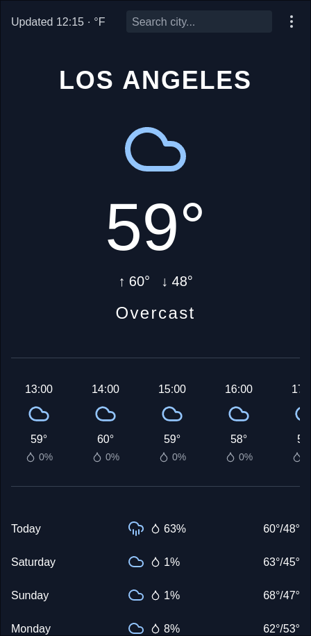

# Dynamic Weather Forecast App

A modern, responsive weather forecast application built with Next.js, TypeScript, and Tailwind CSS. This app provides real-time weather information for any location worldwide, with a sleek and user-friendly interface.



## Features

- **Current Weather Display**: Shows the current temperature, high/low temperatures, and weather condition for the selected location.
- **Hourly Forecast**: Displays a hourly forecasts for the next 36 hours with temperature and precipitation probability.
- **7-Day Forecast**: Provides a 7-day weather outlook including high/low temperatures and precipitation probability.
- **Location Search**: Allows users to search for weather information in any city or location.
- **Geolocation Support**: Users can get weather information for their current location.
- **Dynamic Time and Timezone Handling**: Displays time accurately based on the selected location's timezone.
- **Unit Conversion**: Toggle between Celsius and Fahrenheit temperature units.
- **Responsive Design**: Optimized for both desktop and mobile viewing.
- **LocalStorage**: User settings are saved to the browser for a consistant experience.

## Technologies Used

- **Next.js**: React framework for building the user interface and handling server-side rendering.
- **TypeScript**: For type-safe JavaScript code.
- **Tailwind CSS**: For rapid and responsive UI development.
- **React Hooks**: For state management and side effects.

## API Integrations

- **Open-Meteo API**: Used for fetching weather forecast data.
- **OpenStreetMap Nominatim API**: Used for geocoding (converting location names to coordinates) and reverse geocoding (getting location names from coordinates).

## Project Structure

- `app/page.tsx`: Main component handling state and data fetching.
- `app/components/WeatherDisplay.tsx`: Component for rendering weather information.
- `app/components/Settings.tsx`: Component for user settings (units, location update).
- `app/api/weather/route.ts`: API route for proxying weather data requests.

## Future Improvements

1. Implement caching to reduce API calls and improve performance.
2. Add more detailed weather information (e.g., wind speed, humidity, UV index).
3. Incorporate weather icons and animations to represent different weather conditions.
4. Implement local storage to save favorite locations and app settings.
5. Add accessibility features for better usability.
6. Integrate with a more robust geocoding service for production use.

## Getting Started

First, run the development server:

```bash
npm run dev
# or
yarn dev
# or
pnpm dev
# or
bun dev
```

Open [http://localhost:3000](http://localhost:3000) with your browser to see the result.

You can start editing the page by modifying `app/page.tsx`. The page auto-updates as you edit the file.

This project uses [`next/font`](https://nextjs.org/docs/app/building-your-application/optimizing/fonts) to automatically optimize and load [Geist](https://vercel.com/font), a new font family for Vercel.

## Acknowledgements

- Inspired by and UI clone of the open source [Clima App](https://codeberg.org/Lacerte/clima)

- Weather data provided by [Open-Meteo](https://open-meteo.com/)
- Geocoding services provided by [OpenStreetMap Nominatim](https://nominatim.org/)

## License

This project is open source and available under the [MIT License](LICENSE).
